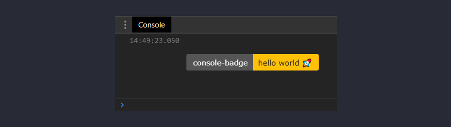
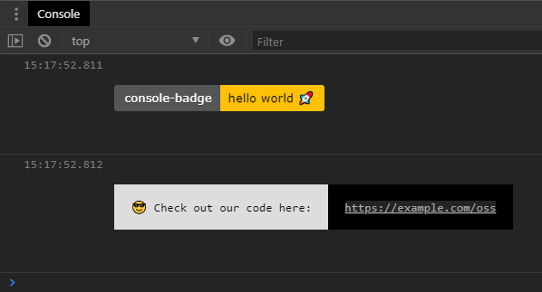

<h1 align="center">🎨 console-badge</h1>

<h3 align="center">Create simple badges in the browser console.</h3>

<p align="center">Tiny, easy-to-use package. No dependencies.</p>

<br>

<p align="center">
  <a href="https://www.npmjs.com/package/console-badge">
    
  </a>
  <a href="https://npmcharts.com/compare/console-badge?minimal=true">
    
  </a>
  <a href="https://bundlephobia.com/result?p=console-badge">
    
  </a>
  <a href="https://www.npmjs.com/package/console-badge">
    
  </a>
</p>

<p align="center">
  <a href="https://standardjs.com">
    
  </a>
</p>

<br>



---

## Features

- **Tiny:** Less than 1kB (minified and gzipped). No dependencies. [ES5-compliant](http://kangax.github.io/compat-table/es5/) code.
- **Customizable:** Change the font colors, background colors and texts. **Tip: You can use the popular [shields.io](https://shields.io/) badge style.** 😎


## Installation

```bash
$ npm install console-badge
# OR
$ yarn add console-badge
```


## Usage

[](https://codesandbox.io/s/static-q1m6n?fontsize=16&module=%2Fsrc%2Findex.js&view=editor)

```js
import * as consoleBadge from 'console-badge';

consoleBadge.log({
  mode: 'shields.io',
  leftText: 'console-badge',
  rightText: 'hello world 🚀',
  rightBgColor: '#ffc107',
  rightTextColor: '#1a1a1a'
});

consoleBadge.log({
  leftText: '😎 Check out our code here:',
  leftTextColor: '#000',
  leftBgColor: '#ddd',
  rightText: 'https://example.com/oss',
  rightBgColor: '#000'
});
```


### Output:




## CDN [](https://www.jsdelivr.com/package/npm/console-badge)

For prototyping or learning purposes, you can use the latest version with:

```html
<script src="https://cdn.jsdelivr.net/npm/console-badge"></script>
```

For production, we recommend linking to a specific version number and build to avoid unexpected breakage from newer versions:

```html
<script src="https://cdn.jsdelivr.net/npm/console-badge@1/dist/console-badge.umd.min.js"></script>
```

```js
// Global variable
consoleBadge.log();
// Property in the window object
window.consoleBadge.log();
```

⚠ NPM is the [recommended installation method](#Installation). It pairs nicely with module bundlers such as [webpack](https://webpack.js.org/).


## API

### .log(options?)

#### options

Type: `Object`

##### mode

Type: `String`<br>
Default: `'default'`<br>
Values:
- `'default'`
- `'shields.io'`

General style of the badge.

##### leftText

Type: `String`<br>
Default: `'Lorem'`

The text inside the **left** section.

##### rightText

Type: `String`<br>
Default: `'Ipsum'`

The text inside the **right** section.

##### leftTextColor

Type: `String`<br>
Default: `'#ffffff'`

The font color of the text inside the **left** section.

##### rightTextColor

Type: `String`<br>
Default: `'#ffffff'`

The font color of the text inside the **right** section.

##### leftBgColor

Type: `String`<br>
Default: `'#555555'`

The background color of the **left** section.

##### rightBgColor

Type: `String`<br>
Default: `'#1966D2'`

The background color of the **right** section.


## Show your support

Please ⭐️ this repository if this project helped you!


## License

[MIT](http://opensource.org/licenses/MIT)

Copyright (c) 2019-present, Dennis Herzberg
